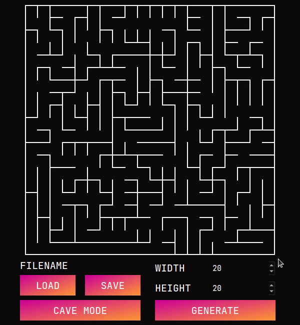
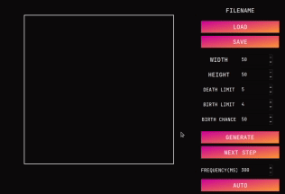

# MAZE

## Содержание 

В данном проекте реализована генерация лабиринта и поиск кратчайшего пути между двумя заданными точками на построенном 
лабиринте. Дополнительно есть функция построения пещер.

1) Генерация пещер осуществляется методом Эллера (http://www.neocomputer.org/projects/eller.html).
2) Генерация пещер осуществляется на основе клеточного автомата (https://en.wikipedia.org/wiki/Cellular_automaton).

Для сборки необходимы:

1) `CMAKE 3.5` или выше
2) `QT 5.15.2` или выше

[//]: # (path to tar.gz data)

## Пример работы

## Лабиринты

Как уже было сказано, построение лабиринтов осуществляется с помощью алгоритма Эллера, нахождение пути
за счет поиска в глубину. 

1) Генерация осуществляется на кнопку `GENERATE` с заданными параметрами количества строк и столбцов 
лабиринта.
2) Количество строк и столбцов лабиринта настраиваются с помощью SpinBox (1-50).
3) Для поиска пути необходимо с помощью `ЛКМ` нажать на первую точку и повторить действия для второй точки.
Будет построен самый короткий путь из точки 1 в точку 2.
4) Для очистки построенного пути - нажмите `ПКМ` на сцену отрисовки.
5) Для загрузки лабиринта из txt файла - кнопка `LOAD`.
6) Для сохранения лабиринта в txt файл - кнопка `SAVE`.

## Пещеры

Построение пещер происходит на основе клеточного автомата, но с небольшим отличием в том, что можно
настраивать параметры для рождения и смерти. Также для удобной визуализации предусмотрен автоматический режим работы.
Для перехода в режим пещер - нужно нажать кнопку `CAVE MODE`

1) Генерация осуществляется на кнопку `GENERATE` с заданными параметрами количества строк, столбцов, предела рождения,
предела смерти и шанса на изначальное появление клетки.
2) Для того, что бы перейти к следующему состоянию пещер - кнопка `NEXT STEP`. 
3) Количество строк и столбцов пещеры настраиваются с помощью SpinBox (1-50).
4) Пределы рождения и смерти клеток настраиваются с помощью SpinBox (0-7).
5) Шанс на изначальное появление клетки настраиваются с помощью SpinBox (1-100).
6) Можно перейти в автоматический режим генерации, для это есть кнопка `AUTO`.
7) Для автоматического режима работы можно задать частоту шага в миллисекундах (300-2000).
8) Для загрузки пещеры из txt файла - кнопка `LOAD`.
9) Для сохранения пещеры в txt файл - кнопка `SAVE`.
